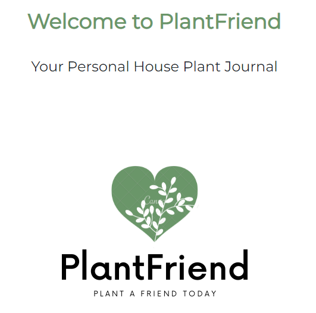
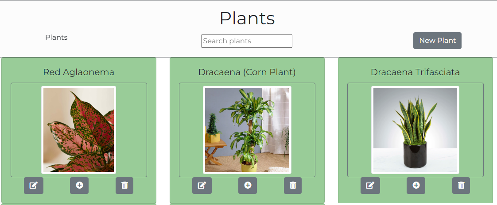
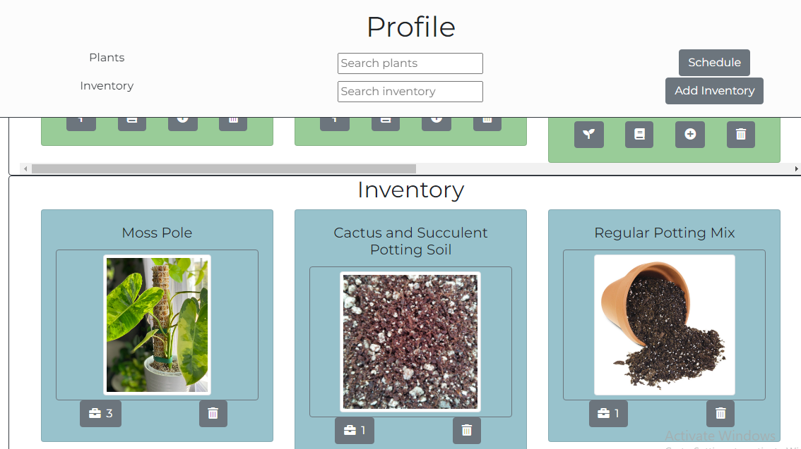
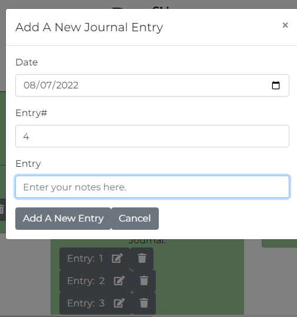
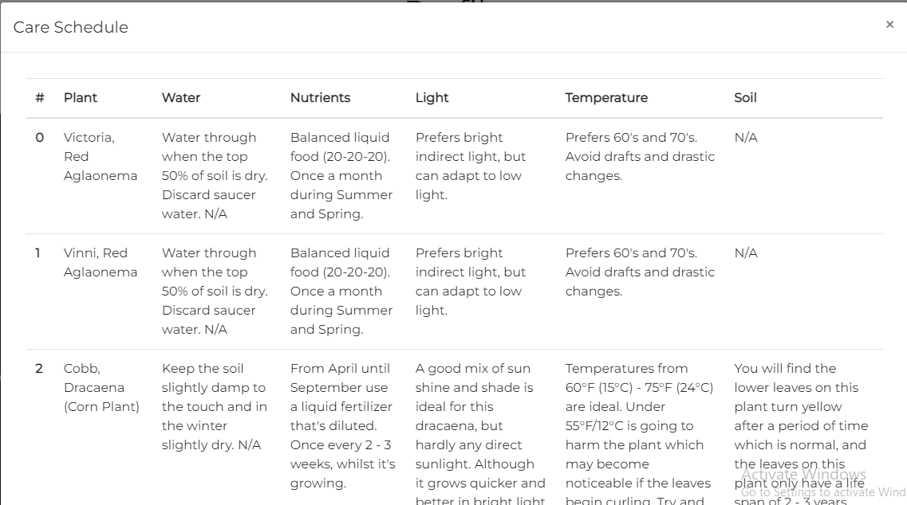

# Plant Friend
Welcome to my custom application that lets you gather research on house plants, add them to your ownership, track your inventory and tools, and see a detailed schedule on how to care for your plants!
### Link to your wireframes/prototype
  [Wireframe](https://www.figma.com/file/ugBHLp0DeroXknr4F4TASM/Plant-Friend-Wireframe?node-id=0%3A1)
### Link to your project board
  [Project Board](https://github.com/GonzalesMatthew/plant-friend/projects/1)
### Description of the user
  Anyone who wants to keep a virtual space for researching new plants, keeping track of tools and inventory, and logging the health of their current house plants.
### List of features                                                
  - Landing Page
  - Research Page
  - Profile Page
  - Search Research/Plant/Inventory objects
  - CRUD Research/Plant/Inventory objects
  - View Schedule of owned house plants
  - Keep individual journals for each owned house plant
### Screenshots of project
- Landing Page

- Research Page

- Profile Page

- Journal

- Schedule

### List of contributors and links to their GH profiles
@GonzalesMatthew
### Link to Loom video walkthrough of your app
[App-Walkthrough Video](https://www.loom.com/share/2fb6b2c17a4e448fad9c1ddfa7158fe4)
